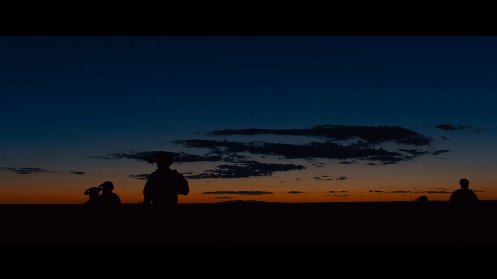
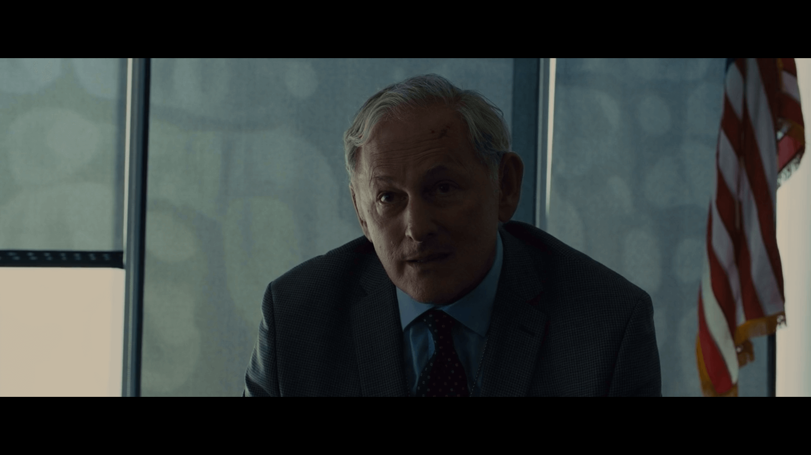
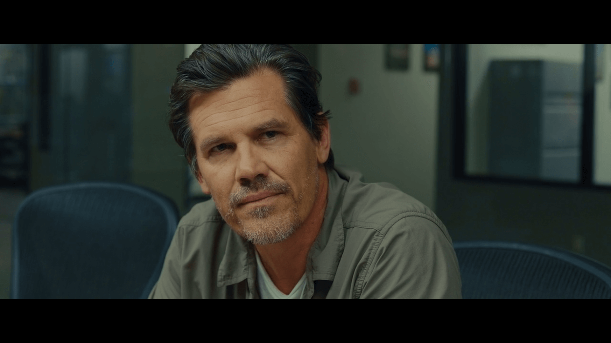
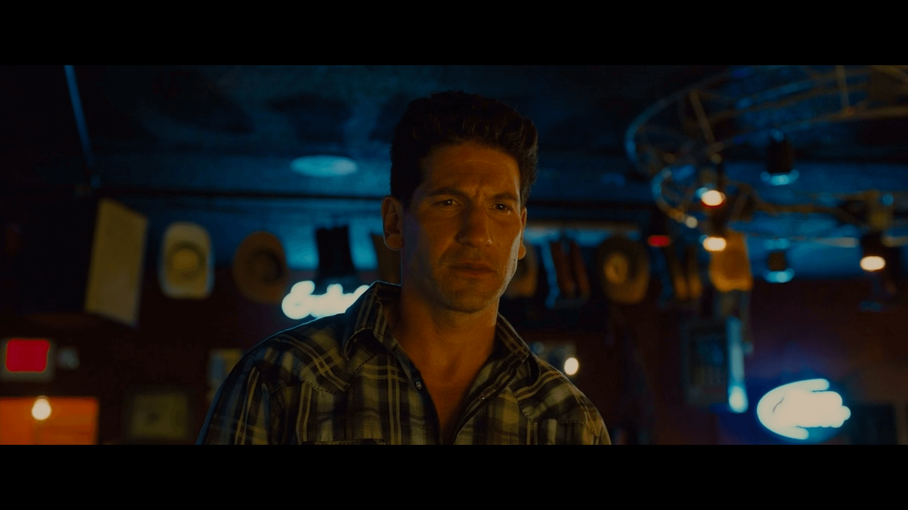
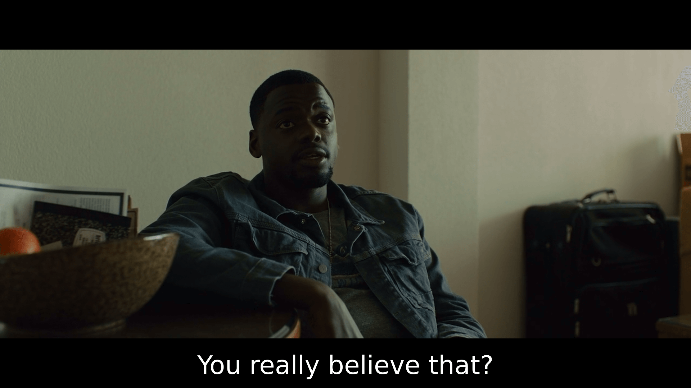
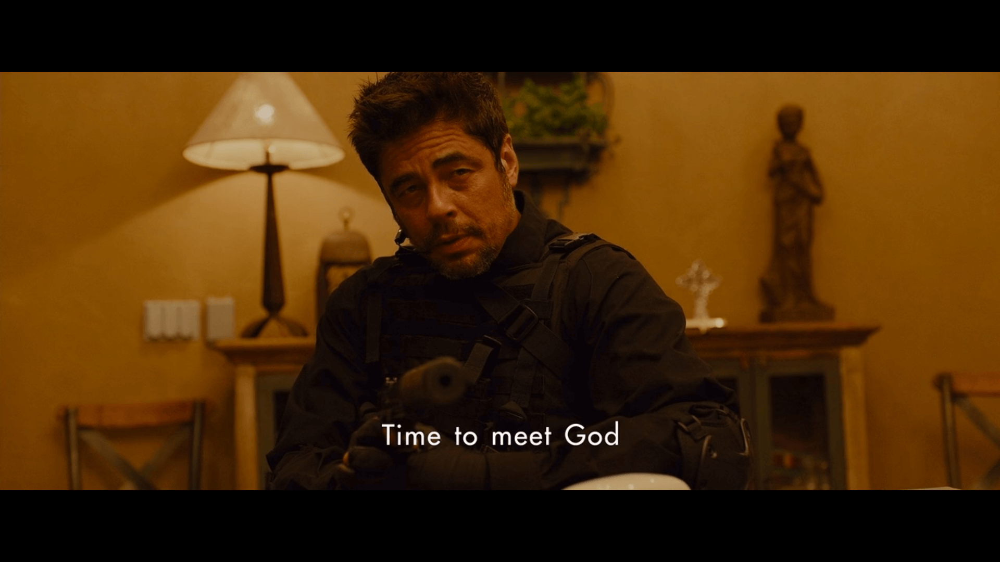
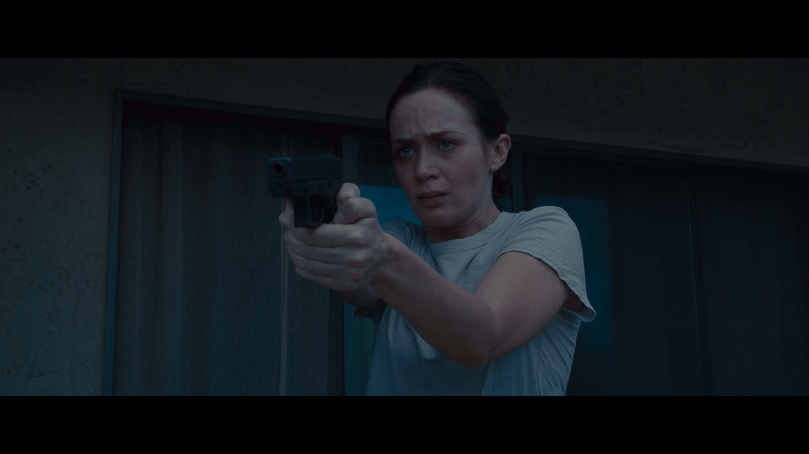

> Sicario  
> **2015**  
> **Dennis Villeneuve**

Real. No dramatized slow motion action scenes, quick military lingo, depiction of true crime, and a barely related alternate storyline. These make many scenes in this movie less movie-like and more real-life. But there is drama, in the right places. There are long shots with no dialogues with heavy background music infused with real noise from objects in the scene such as helicopters, or men walking with guns amidst a picturesque sunset.

The movie wants to be taken seriously. It wants the viewer to think and try to decode what is happening, what will happen in the future. I believe the existence of movies that give the viewer ample time and appropriate music to think is a blessing and all the critical praise that they garner is well deserved.

The story is not told, the viewer learns about it as the movie progresses, along with Kate - the protagonist - who is kept in the dark about the happenings by her usual boss - our very own Titanic's captain  and her new temp boss  - who has a lot of Audiences' Superstar [^1] characteristics - wears slippers to meetings, bends rules and is a general badass. The protagonist's friend is our dude with expressive eyes and a funny perplexed countenance, from [Black Mirror](http://www.imdb.com/title/tt2089049/?ref_=ttep_ep2) and [Get Out](http://www.imdb.com/title/tt5052448/). He is the supplier of 'let's get real here'. When things don't make sense, he asks. He sets his friend up with 'good' guys he knows. And apologises later when they turn out to be [The Punisher](http://www.imdb.com/title/tt5675620/) (hehe).  He is the audiences' connect to the sane everyday world. 

It is clear what 'Sicario' means - but who is Sicario in this movie? There are multiple Audiences' Superstars [^2] for sure, but who is the Sicario amongst them. We know that there could only be one person who this movie is named after because we were shown in the earliest quote in the movie that Sicario means *hitman*, not *hitmen*. Audiences' Superstar is a character that is made just so that viewers like/admire/drool over them. This trait is present in all the leading guy characters in romantic movies. Barney Stinson from How I Met Your Mother is an over-the-top extreme version of Audiences' Superstar. In Sicario, the viewer is exposed to a lot of these. The mapping of Sicario to one of these is a mystery that unfolds slowly, and keeps on unfolding towards the penultimate scene. This is what kept me intrigued - not being able to know who the movie named after.  

The penultimate scene could have changed the Sicario of the movie. It only depended on a bullet.
  But the finger was never on the trigger.

[^1]: wait for it
[^2]: just a little longer